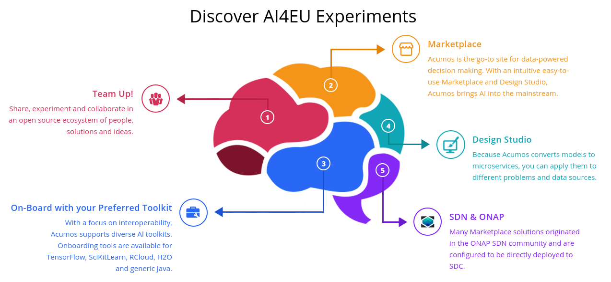

# gRPC-ros-client 

 

This project depends on [Single input/single output gRPC server](https://github.com/ipa-rar/gRPC-servers/tree/main/demo_simple_communication): calls RPC if message is present for input queue, result is written to output queue.

This project is part of [AI4EU](https://www.ai4eu.eu/). For more information check the RAMP Catalogue entry for the
[components](https://github.com/ai4eu).

:whale: [Docker Hub](https://hub.docker.com/repository/docker/ragesh18/grpc-ros-client)
 

## Contents

-   [Background](#background)
-   [Install](#install)
-   [Usage](#usage)
-   [API](#api)
-   [Testing](#testing)
-   [Feedback](#feedback)
-   [Contribution](#contribution)
-   [License](#license)

## Background
The AI4EU Platform will act as the one-stop-shop for anyone looking for AI knowledge, technology, services, software, and experts. AI4EU will function as European AI market driver, offering a critical mass of resources, community networking effects, and rapid development and growth. [Acumos AI](https://acumos-int-fhg.ai4eu.eu/#/home) is a marketplace and design studio where community can share their Machine Learning and AI models as microservices so that it can be applied to different problems and data sources

## Objective
The main objective is to enable robots to directly use the AI/ML models served as microservices directly onboard. Robot Operating System(ROS) is a de-facto framework used for programming robots across industries and researchers. This system is aimed to bridge the gap between the microservice ML models and the ROS system. 

## Install

Information about how to install the `gRPC-ros-bridge` can be found at the corresponding section of the
[Installation Guide](docs/installationguide.md).

## Usage

Information about how to use the `gRPC-ros-bridge` can be found in the [User & Programmers Manual](docs/usermanual.md).

## Testing
## To Do
- Write [unit tests and integration tests](https://answers.ros.org/question/356180/ros2-creating-integration-tests-for-python-nodes/) for the nodes

## Feedback

We use github to host code, to track issues and feature requests, as well as accept pull requests. Any feedback and suggestions can be submitted by creating New issue in the Issues tab or by emailing the team. 

## Contribution

Pull requests are the best way to propose changes to the codebase (we use [Github Flow](https://guides.github.com/introduction/flow/index.html)). We actively welcome your pull requests:

1. Fork the repo and create your branch from `master`.
2. If you've added code that should be tested, add tests.
3. If you've changed APIs, update the documentation.
4. Ensure the test suite passes.
5. Make sure your code lints.
6. Issue that pull request!

## License

By contributing, you agree that your contributions will be licensed under its [BSD 2-Clause](https://opensource.org/licenses/BSD-2-Clause) license.

