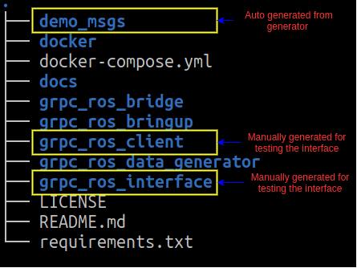

# Architecture
Based on ROS-Noetic
- **grpc_ros_interface** - This package is auto generated by the generator with the protobuff signature files
- **grpc_ros_data_generator** - The package generates the data and behave as a gRPC client. It also subscribes to the response from the server.
- **grpc_ros_client** - This package contains the autogenerated files from the protoc-compiler. This is necessary for ROS<-->gRPC message translation. `grpc_ros_client.py` simply echos what it hears from the gRPC server back to the `grpc_ros_data_generator.py`

